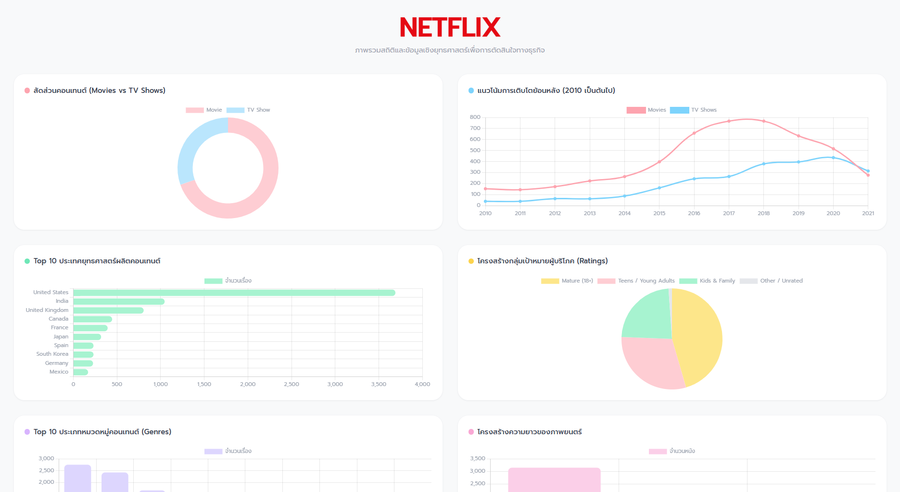
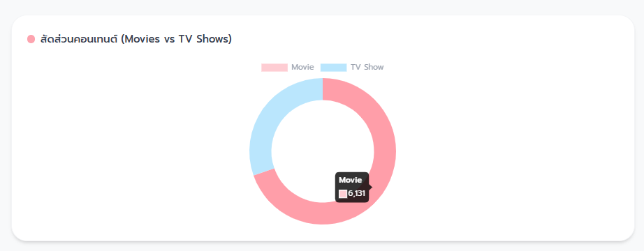
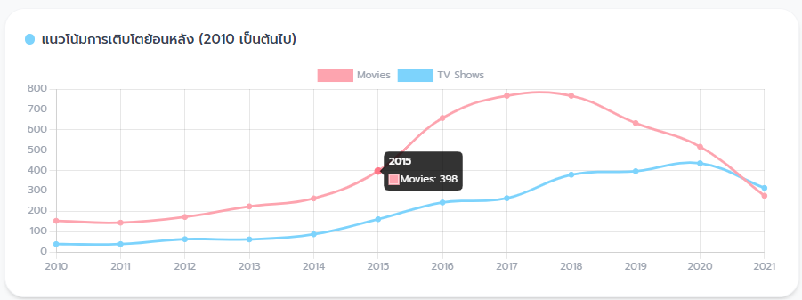
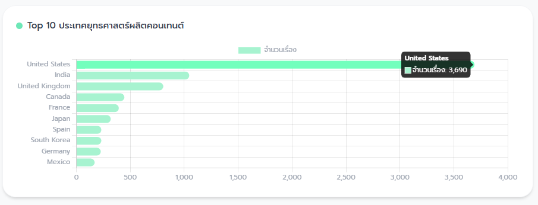
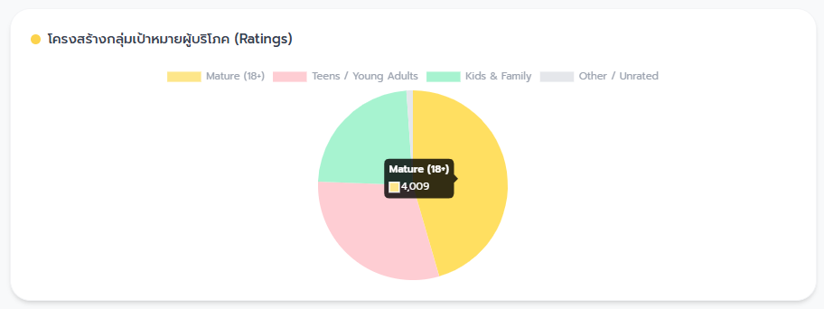
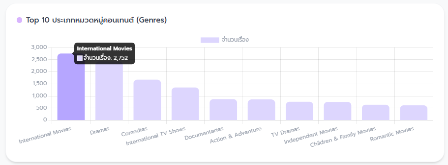
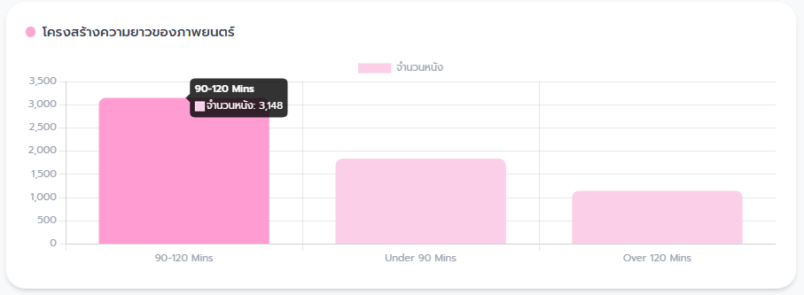
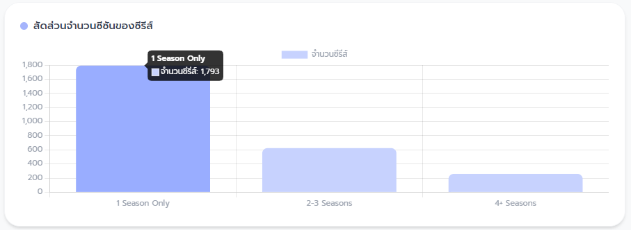
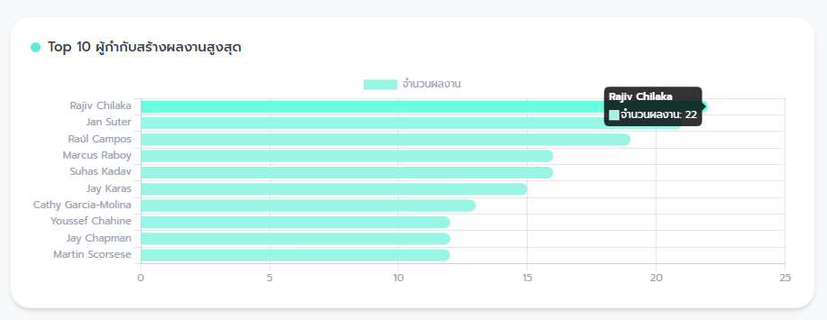

# 🎬 Netflix Executive Dashboard

แดชบอร์ดสรุปสถิติและวิเคราะห์ข้อมูลเชิงยุทธศาสตร์ของ **Netflix** สำหรับผู้บริหาร
---

## 📸 ภาพรวม Dashboard ทั้งหมด (Overall Overview)

---

### 1. สัดส่วนคอนเทนต์ (Movies vs TV Shows)
ประเมินสัดส่วนหนังจบในตอนเทียบกับซีรีส์เพื่อวัด Customer Retention และโครงสร้างประเภทคอนเทนต์

---

### 2. แนวโน้มการเติบโตย้อนหลัง (Growth Trends)
ติดตามอัตราการเพิ่มขึ้นของคอนเทนต์ตั้งแต่ปี 2010 เป็นต้นไป เพื่อวิเคราะห์ทิศทางสายการผลิต

---

### 3. Top 10 ประเทศยุทธศาสตร์
วิเคราะห์ตลาดหลักและตลาดใหม่ในการจัดหา/ผลิตคอนเทนต์ เพื่อกระจายการลงทุนระดับภูมิภาค

---

### 4. กลุ่มเป้าหมายผู้บริโภค (Content Ratings)
จำแนกสัดส่วนเรตติ้งเพื่อประเมินฐานผู้รับชม (เด็ก, วัยรุ่น, ผู้ใหญ่) และความครอบคลุมของกลุ่มเป้าหมาย

---

### 5. Top 10 หมวดหมู่คอนเทนต์ (Genres)
สำรวจแนวหนังยอดนิยมและค้นหาช่องว่างตลาด (Opportunity Window) สำหรับคอนเทนต์ประเภทใหม่ๆ

---

### 6. โครงสร้างความยาวภาพยนตร์ (Movie Durations)
วิเคราะห์ช่วงความยาวหนังที่เหมาะสมเพื่อเพิ่มอัตราการรับชมจนจบ (Completion Rate)

---

### 7. จำนวนซีซันของซีรีส์ (TV Show Longevity)
ดูสัดส่วนซีรีส์ที่มีหลายซีซันเพื่อวัดความยั่งยืนของฐานแฟนคลับและคุณค่าสินทรัพย์ระยะยาว

---

### 8. Top 10 ผู้กำกับสร้างผลงานสูงสุด
ระบุ Talent แม่เหล็กที่มีผลงานร่วมกับแพลตฟอร์มสูงสุด สำหรับการพิจารณาเซ็นสัญญา Exclusive Deal

